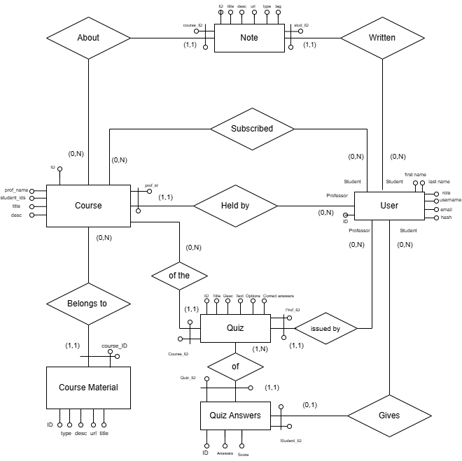

# Spark - Microservices E-Learning Platform

## Introduction
Spark is an educational platform designed to streamline course management, content sharing, and assessments for both professors and students. Built on a modern microservices architecture, the platform fosters a collaborative learning environment. 
* **Professors** can create new courses, upload educational materials, and design quizzes to assess student knowledge.
* **Students** can easily enroll in courses, access shared resources, take tests, and share their personal notes with peers.

## Technologies used
This project was developed using:
| Technology | Purpose |
|------------|---------|
| **Node.js** | JavaScript runtime for server-side applications. |
| **Express.js** | Framework for building RESTful APIs and handling HTTP requests. |
| **PostgreSQL** | Relational database used by all microservices. |
| **Sequelize** | ORM used to define models, execute queries, and synchronize the database. |
| **RabbitMQ** | Message broker used for asynchronous communication and RPC between microservices. |
| **JWT** | Authentication through JSON Web Tokens stored in HTTP-only cookies. |
| **Bcrypt** | Password hashing. |
| **Docker** | Containerization and orchestration of all services. |
| **Frontend** | Vanilla HTML, CSS, and JavaScript served directly by the microservices. |

The entire application follows a **microservices architecture** built with **Node.js**, **Express**, **Sequelize**, and **RabbitMQ**, all running inside **Docker** containers.

# Architecture

The platform is composed of independent microservices communicating asynchronously through RabbitMQ.

**Architectural Diagram:**   
<p align="center">
  
</p>

**Database structure and relationships:**   
<p align="center">
  
</p>

# Repository Structure

Each microservice runs in its own Docker container and exposes a dedicated port.

| Service | Port | Description |
| :--- | :--- | :--- |
| **User Service** | 8080 | Authentication, registration, and role management. |
| **Student Service** | 7070 | Student operations, notes creation, sharing, and visualization. |
| **Course Service** | 6060 | Course, material, and quiz management. |
| **PostgreSQL** | 5432 | Stores users, courses, notes, and quizzes. |
| **RabbitMQ** | 5672 / 15672 | Message broker used for communication between services. |

## Internal Structure of Each Microservice

Each service follows the same organization:

```
microservice/
│
├── public/
│   ├── HTML
│   ├── CSS
│   ├── JavaScript
│   └── Uploaded files
│
├── src/
│   ├── *_repo.js
│   ├── *_service.js
│   ├── *_route.js
│   ├── *.js (Sequelize models)
│   └── rabbitmq/
│       ├── producer.js
│       ├── consumer.js
│       └── *-s.js
│
├── package.json
├── Dockerfile
├── config.js
└── index.js
```

### File Description

- `public/`: Contains static assets (HTML, CSS, JavaScript) and uploaded files.
- `src/`: Contains the application logic divided into three layers:
    - `*_repo.js` → database queries
    - `*_service.js` → business logic
    - `*_route.js` → HTTP endpoints and request handling
    - `*.js` → Sequelize model definitions
- `src/rabbitmq/`: Contains the RabbitMQ communication logic:
    - `producer.js` → sends messages
    - `consumer.js` → receives messages
    - `*-s.js` → coordinates producer and consumer communication

Root files:   
- **package.json** → dependencies and scripts
- **Dockerfile** → container definition
- **index.js** → starts the server
- **config.js** → RabbitMQ configuration
- **docker-compose.yml** → defines services, networking, environment variables, dependencies, and persistent database volumes

## How to Run Locally
To run this project on your local machine, you will need Docker and Docker Compose installed.

1. **Clone the repository:**
   `git clone https://github.com/ClaudiaCornacchia/Spark-Microservices-Elearning-Platform.git`
2. **Set up Environment Variables:**
   The project requires secure keys (like `ACCESS_TOKEN_SECRET`) to generate JWTs. For development purposes, we have provided template files. Run the following commands in your terminal to create your local `.env` files:
   `cp services/user-service/.env.example services/user-service/.env`
   `cp services/student-service/.env.example services/student-service/.env`
   `cp services/course-service/.env.example services/course-service/.env`
3. **Build and start the Docker containers:**
    ```bash
    docker-compose up --build
    ```

    The `--build` option builds the images before starting the containers.

    Required packages:

    ```bash
    npm i bcryptjs body-parser cookie-parser cors dotenv express jsonwebtoken nodemon path pg sequelize amqplib multer
    ```

4. **Access the platform:**
   Open your browser and navigate to `http://localhost:8080` to access the main landing page.


     

# PostgreSQL Connection (PgAdmin)

To inspect the database using PgAdmin, create a new server with:

| Parameter | Value |
|-----------|-------|
| Host | localhost |
| Port | 5432 |
| Database | usersdb *(or students / coursesdb depending on the service)* |
| Username | user |
| Password | password |


# RabbitMQ

RabbitMQ is used to implement RPC communication between microservices.

**Communication Flow**, two queues are involved:
- **rpcQueue**
- **replyQueue**
The client microservice sends requests through `rpcQueue`, while the RPC server answers using `replyQueue`.

**Client Workflow:**   
1. An HTTP request arrives (e.g. `/getUsername`).
2. The request is handled in `*_route.js`.
3. The route invokes the producer defined in `*-s.js`.
4. `produceMessage(data)` (inside `producer.js`) publishes the request to `rpcQueue`.

**RPC Server Workflow:**  
1. `consumer.js` continuously listens on `rpcQueue`.
2. The requested data is retrieved from the database.
3. The producer sends the response through the client's `replyQueue`.

**Client Response:** The client's `consumer.js` continuously listens on `replyQueue` and retrieves the response.

**Queues Used:**
This project defines two RPC queues inside `config.js`:
- `rpcQueue` → listened by **user-service**
- `rpcQueueC` → listened by **course-service**


      
# Authentication

Authentication is based on **JWT (JSON Web Tokens)** stored inside HTTP-only cookies.

## 1. Login

When a user submits email and password:
- the request reaches `user_route.js`
- credentials are validated in `user_service.js`
- passwords are verified with **bcrypt**
- a JWT is generated with `jwt.sign()`
- the token is stored in a cookie using `res.cookie()`

The token is signed using `ACCESS_TOKEN_SECRET`.

The `.env` files are not tracked by Git and must be created locally for each microservice.

## 2. Authenticated Requests

For every protected request:

- the microservice extracts the JWT from cookies;
- `jwt.verify()` validates the token;
- if valid, the requested operation is executed.


# Authors

This project was developed for the **Advanced Programming Laboratory** module as part of my Master's Degree [Link to the original Repository](https://github.com/chiara01712/1988552_SPARK)

- [Claudia Cornacchia](https://github.com/ClaudiaCornacchia)
- [Andrea Lanzarone](https://github.com/AndreLanza1)
- [Chiara Cervelli](https://github.com/chiara01712)
- [Alessio Calcagni](https://github.com/AlessioCalcagni0)
